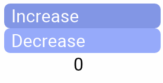

# Button



The button widget is probably one of the most essential things in all of the UI making world.

You can create buttons using

```rust
Button::new(
    Text::new("Hello".to_string())
).with_on_pressed(|state: &mut MyState| {
    println!("Hello World");
    Update::DRAW
})
```

For a more complex example, see the counter example:

```rust
use maycoon::core::app::update::Update;
use maycoon::core::app::MayApp;
use maycoon::core::config::MayConfig;
use maycoon::core::layout::{AlignItems, Dimension, FlexDirection, LayoutStyle};
use maycoon::core::state::Val;
use maycoon::macros::{val, State};
use maycoon::math::Vector2;
use maycoon::widgets::button::Button;
use maycoon::widgets::container::Container;
use maycoon::widgets::text::Text;

#[derive(State)]
struct MyState {
    count: i32,
}

fn main() {
    MayApp::new(MayConfig::default()).run(
        MyState { count: 0 },
        Container::new(vec![
            Val::new_val(Box::new(
                Button::new(Text::new("Increase".to_string())).with_on_pressed(
                    |state: &mut MyState| {
                        state.count += 1;
                        Update::DRAW
                    },
                ),
            )),
            Val::new_val(Box::new(
                Button::new(Text::new("Decrease".to_string())).with_on_pressed(
                    |state: &mut MyState| {
                        state.count -= 1;
                        Update::DRAW
                    },
                ),
            )),
            Val::new_val(Box::new(Text::new(val!(|state: &MyState| state
                .count
                .to_string())))),
        ])
        .with_layout_style(LayoutStyle {
            size: Vector2::<Dimension>::new(Dimension::Percent(1.0), Dimension::Percent(1.0)),
            flex_direction: FlexDirection::Column,
            align_items: Some(AlignItems::Center),
            ..Default::default()
        }),
    );
}
```
