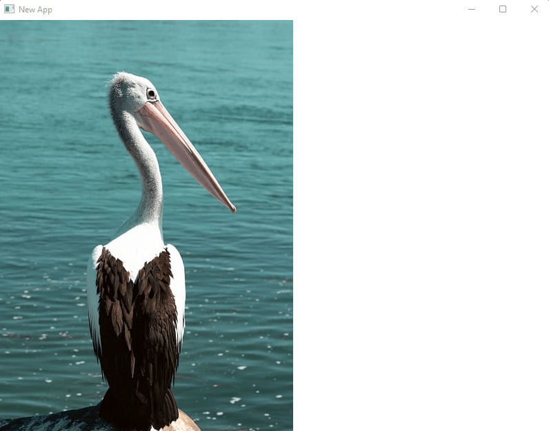

# Image



The image widget can be used to display... well... images.

You will most probably need the `image` crate to convert an image to `Rgba8`.

```rust
Image::new(
    ImageData::new(
        image_data.clone(),
        Vector2::new(427, 640),
        peniko::Format::Rgba8,
    )
)
```

See the whole image widget example for full usage:

```rust
use maycoon::core::app::MayApp;
use maycoon::core::config::MayConfig;
use maycoon::core::vg::peniko;
use maycoon::macros::State;
use maycoon::math::Vector2;
use maycoon::widgets::image::{Image, ImageData};

#[derive(State)]
struct MyState;

fn main() {
    let image_data = image::open("../image/pelican.jpg")
        .unwrap()
        .into_rgba8()
        .to_vec();

    MayApp::new(MayConfig::default()).run(
        MyState,
        Image::new(ImageData::new(
            image_data.clone(),
            Vector2::new(427, 640),
            peniko::Format::Rgba8,
        )),
    )
}
```
